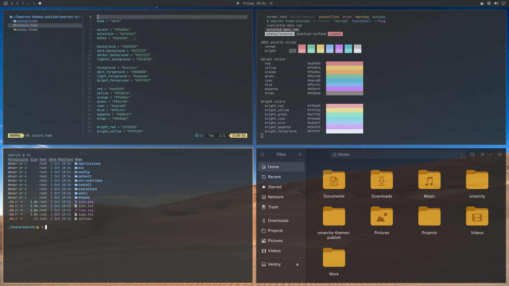

# Dunes

A warm dark theme for [Omarchy](https://omarchy.org) with desert wallpapers,
grey surfaces, an orange accent (`#fbb86c`) and teal highlights. Its colors
are inspired by the classic GNOME-era GTK palette of Pop!_OS 22.04.



## Install

```bash
omarchy theme install https://github.com/Esegnorelli/omarchy-dunes-theme
```


## Wallpapers

An illustrated robot over a city skyline by default, plus starry desert
dunes, space, illustrated desert, canyon and moon. Cycle them with `omarchy theme bg next`.

## Credits & license

Theme files are MIT licensed. Wallpapers keep their own licenses, listed in
[CREDITS.md](CREDITS.md).

*Not affiliated with or endorsed by System76. Pop!_OS is a trademark of
System76; it is mentioned only to describe where the color inspiration came
from.*
